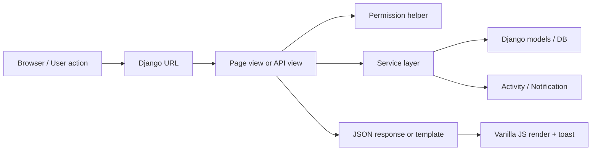

# Cau truc xuong song TaskFlow

Ngay cap nhat: 2026-06-28

## 1. Tech stack

- Backend: Django 4.2, Channels, Daphne.
- Frontend: Django templates, vanilla JavaScript, Tailwind CSS build local.
- Database: MySQL cho moi truong that, SQLite co the dung cho local test khi MySQL chua bat.
- Auth: Django auth, django-allauth/socialaccount da co trong migrations.
- Styling: Tailwind CLI build tu `frontend/static/css/tailwind.css` sang `frontend/static/css/app.css`.

## 2. Thu muc chinh

```text
TaskManagement/
  backend/
    config/
      settings.py
      urls.py
      asgi.py
      wsgi.py
    apps/
      tasks/
        api/
          consumers/
          urls/
          views/
          responses.py
          serializers.py
        middleware/
        migrations/
        models/
        selectors/
        services/
        tests/
        views/
        permissions.py
        urls.py
    manage.py
    requirements.txt
  frontend/
    static/
      css/
        tailwind.css
        app.css
      js/
        core/
        pages/
        auth.js
        files.js
        settings.js
    templates/
      auth/
      components/
      layouts/
      pages/
      partials/
      settings/
      tasks/
  docs/
    BA_TASKFLOW.md
    PROJECT_STRUCTURE.md
  package.json
  tailwind.config.js
```

## 3. Backend backbone

### Config

- `backend/config/settings.py`: cau hinh Django, database, static, installed apps, middleware.
- `backend/config/urls.py`: include page routes va API routes.
- `backend/config/asgi.py`: entry point cho Daphne/Channels.

### Domain app

- `backend/apps/tasks/models/`: data model chinh.
- `backend/apps/tasks/services/`: xu ly nghiep vu va transaction.
- `backend/apps/tasks/permissions.py`: ham kiem tra quyen.
- `backend/apps/tasks/api/views/`: API endpoint tra JSON.
- `backend/apps/tasks/api/urls/`: URL theo module.
- `backend/apps/tasks/views/`: page views tra template.
- `backend/apps/tasks/tests/`: unit/API tests.

### Model modules

- `team.py`: `Team`, `TeamMember`.
- `project.py`: `Project`, `ProjectMember`.
- `task.py`: `Task`.
- `task_detail.py`: `TaskComment`, `TaskAttachment`.
- `favorite.py`: `TaskFavorite`, `ProjectFavorite`.
- `activity.py`: `Notification`, `TaskActivity`.
- `invitation.py`: `TeamInvitation`, `TeamInvitationProject`.
- `friendship.py`: `Friendship`.
- `chat.py`: `ChatMessage`.

### Permission layer

- `can_view_workspace(user, team)`
- `can_manage_workspace(user, team)`
- `can_view_project(user, project)`
- `can_manage_project(user, project)`
- `can_edit_task(user, task)`

Nguyen tac: API/view khong nen tu viet lai logic quyen. Service hoac view goi permission helper truoc khi ghi DB.

### Service layer

- `services/teams.py`: tao workspace, member, invite/presence.
- `services/projects.py`: tao/sua/xoa project, project member/favorite.
- `services/tasks.py`: tao/sua/xoa task, status, schedule, favorite, comment, attachment.
- `services/notifications.py`: tao/list/mark read notification.
- `services/invitations.py`: xu ly invitation token va acceptance.

Nguyen tac: view chi parse request va tra response; service chiu trach nhiem validation, transaction, ghi activity/notification.

## 4. Frontend backbone

### Templates

- `frontend/templates/layouts/base.html`: layout chinh sau dang nhap.
- `frontend/templates/auth/login.html`: login/sign up.
- `frontend/templates/pages/dashboard/index.html`: dashboard.
- `frontend/templates/pages/timeline/index.html`: workspace/project/task timeline.
- `frontend/templates/pages/team/index.html`: team/invite/friends/chat.
- `frontend/templates/files/index.html`: file view.
- `frontend/templates/settings/index.html`: settings view.
- `frontend/templates/components/`: empty/loading shared components.
- `frontend/templates/partials/design_tokens.html`: CSS/font include shared.

### JavaScript

- `frontend/static/js/core/api.js`: wrapper API va error parsing.
- `frontend/static/js/core/csrf.js`: CSRF helper.
- `frontend/static/js/core/dom.js`: DOM utilities.
- `frontend/static/js/core/storage.js`: theme/active state/filter local storage.
- `frontend/static/js/core/toast.js`: toast feedback.
- `frontend/static/js/auth.js`: login/sign up UX.
- `frontend/static/js/pages/dashboard.js`: dashboard load/render/mutation.
- `frontend/static/js/pages/team.js`: team, invite, friends, chat.
- `frontend/static/js/pages/timeline.js`: entry for project/task page.
- `frontend/static/js/pages/timeline/api.js`: timeline API calls.
- `frontend/static/js/pages/timeline/actions.js`: mutation actions.
- `frontend/static/js/pages/timeline/renderers.js`: render project/task views.
- `frontend/static/js/pages/timeline/modals.js`: modal handling.
- `frontend/static/js/pages/timeline/interactions.js`: drag/drop and UI interaction.

### CSS build

Input:

```text
frontend/static/css/tailwind.css
```

Output:

```text
frontend/static/css/app.css
```

Config:

```text
tailwind.config.js
```

Template include:

```text
frontend/templates/partials/design_tokens.html
```

Build command:

```powershell
npm run build:css
```

## 5. Request flow



## 6. Data flow theo module

### Dashboard

1. Browser mo `/dashboard/`.
2. Template load dashboard JS.
3. JS goi `/api/dashboard/data/`.
4. API aggregate workspace/project/task theo user.
5. FE render workspace cards, analytics, status overview va empty state.

### Workspace va Project

1. Browser mo `/project/`.
2. JS goi `/api/project/data/`.
3. User tao workspace qua `/api/teams/`.
4. User tao project qua `/api/projects/`.
5. FE cap nhat active workspace/project va render timeline.

### Task

1. User bam Add Task.
2. FE mo modal rut gon.
3. FE gui task vao `/api/projects/<id>/tasks/`.
4. Service validate va luu `Task`.
5. Service ghi `TaskActivity` va optional notification.
6. FE render task va toast `Saved`.

### Team va Invite

1. User mo `/team/`.
2. JS goi `/api/team/data/`.
3. Owner/admin gui invite qua API invitations/teams.
4. Service validate email, role, duplicate pending.
5. Service tao `TeamInvitation`, optional `TeamInvitationProject`.

### Chat

1. User authenticated mo room chat.
2. WebSocket connect qua Channels.
3. Consumer kiem tra user va room hop le.
4. Sender luon lay tu `scope["user"]`.
5. Message luu vao `ChatMessage`.

## 7. Chay local

Neu MySQL dang chay va `.env` dung:

```powershell
cd E:\htdakt\TaskManagement\backend
.\.venv\Scripts\python.exe manage.py migrate
.\.venv\Scripts\daphne.exe -b 127.0.0.1 -p 8000 config.asgi:application
```

Neu MySQL chua bat, dung SQLite local:

```powershell
cd E:\htdakt\TaskManagement\backend
$env:DB_ENGINE='django.db.backends.sqlite3'
$env:DB_NAME='E:\htdakt\TaskManagement\db.sqlite3'
.\.venv\Scripts\python.exe manage.py migrate
.\.venv\Scripts\daphne.exe -b 127.0.0.1 -p 8000 config.asgi:application
```

Mo app:

```text
http://127.0.0.1:8000/login/
```

## 8. Kiem thu va quality gate

Backend:

```powershell
cd E:\htdakt\TaskManagement\backend
$env:DB_ENGINE='django.db.backends.sqlite3'
$env:DB_NAME='E:\htdakt\TaskManagement\db.sqlite3'
.\.venv\Scripts\python.exe manage.py check
.\.venv\Scripts\python.exe manage.py makemigrations --check --dry-run
.\.venv\Scripts\python.exe manage.py test
```

Frontend syntax:

```powershell
cd E:\htdakt\TaskManagement
node --check frontend\static\js\auth.js
node --check frontend\static\js\pages\dashboard.js
node --check frontend\static\js\pages\timeline.js
node --check frontend\static\js\pages\team.js
```

CSS:

```powershell
cd E:\htdakt\TaskManagement
npm run build:css
```

Browser smoke test:

1. Mo `/login/`.
2. Dang ky user test.
3. Dashboard hien empty state.
4. Tao workspace.
5. Tao project trong workspace.
6. Tao task.
7. Reload va kiem tra task van con.

## 9. Nguyen tac phat trien tiep

- Khong them mock/demo fallback vao flow du lieu nghiep vu.
- Khong ghi DB trong GET endpoint.
- Moi mutation can co permission check va validation.
- Moi flow nhieu buoc can transaction.
- FE mutation can co toast va rollback neu loi.
- Nut chinh va icon action can co click target toi thieu 40px.
- Khi sua UI, can test desktop va mobile viewport.
- Khi them API, cap nhat BA/API contract va test lien quan.
