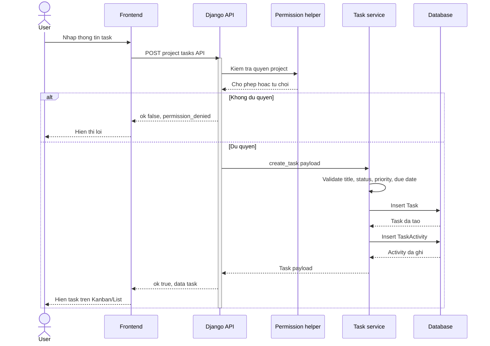

# TaskFlow Create Task Sequence

Sequence nay dung cho slide "Luong xu ly tao task". Luong chinh: user gui form, backend kiem tra workspace/project/permission, validate payload, luu task vao database, ghi activity va tra task moi ve frontend.

