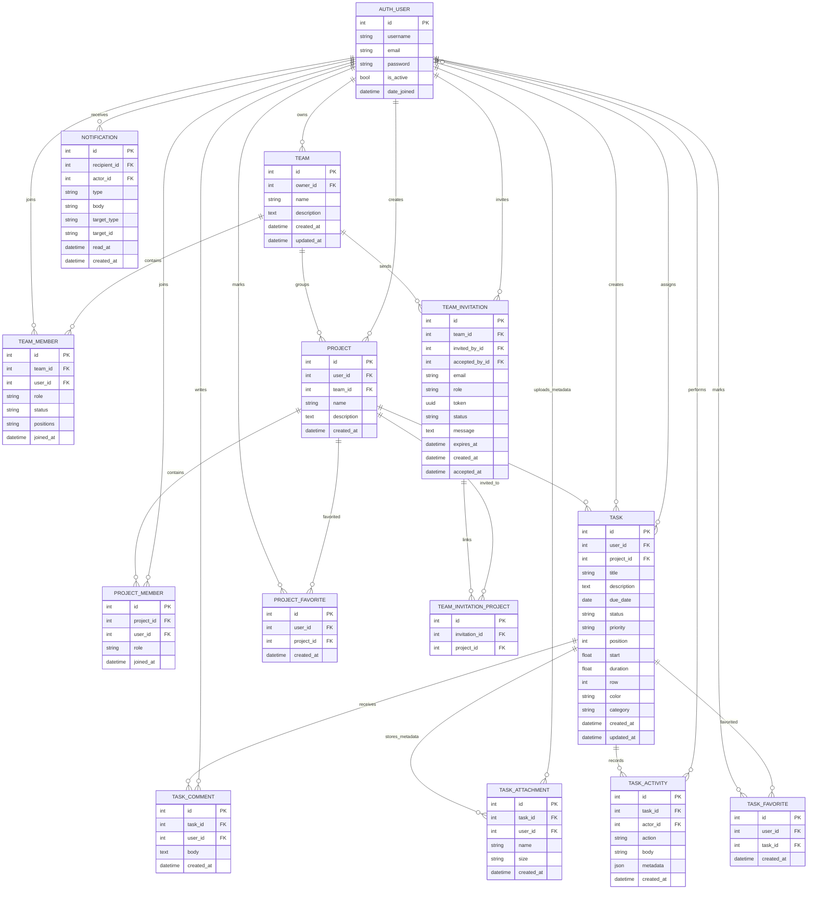

# TaskFlow ERD Overview

ERD nay bam theo cac model hien co trong `backend/apps/tasks/models/`. Luu y: `Task.assignees` va `Task.favorited_by` la many-to-many cua Django; diagram the hien quan he nghiep vu, con bang trung gian do Django tu quan ly.

