# TaskFlow Kanban Position Flow

So do nay dung cho slide "Luong Kanban". Diem nghiep vu quan trong la `position` phuc vu thu tu Kanban, con `row` phuc vu timeline/Gantt; hai truong khong duoc ghi nham cho nhau.

```mermaid
flowchart LR
    OpenProject([User mo project])
    DragTask[Keo task tren Kanban]
    SendPatch[Frontend gui PATCH position]
    LoadTask[Backend tim task visible]
    CanEdit{User co quyen sua?}
    Denied[Tra ve permission_denied]
    Apply[Cap nhat task.position]
    KeepRow[Giu nguyen task.row neu FE khong gui row]
    Save[(Luu database)]
    Activity[Ghi TaskActivity position_changed]
    Response[Tra ve task payload]
    Render[Frontend sap xep lai Kanban]
    Reload[Reload van giu thu tu]

    OpenProject --> DragTask
    DragTask --> SendPatch
    SendPatch --> LoadTask
    LoadTask --> CanEdit
    CanEdit -->|Khong| Denied
    CanEdit -->|Co| Apply
    Apply --> KeepRow
    KeepRow --> Save
    Save --> Activity
    Activity --> Response
    Response --> Render
    Render --> Reload

    classDef user fill:#3b82f6,stroke:#1e40af,color:#fff
    classDef admin fill:#f59e0b,stroke:#b45309,color:#fff
    classDef cmsdev fill:#6d28d9,stroke:#4c1d95,color:#fff
    classDef system fill:#64748b,stroke:#334155,color:#fff
    classDef db fill:#10b981,stroke:#047857,color:#fff
    classDef external fill:#e11d48,stroke:#9f1239,color:#fff

    class OpenProject,DragTask,Render,Reload user
    class SendPatch,LoadTask,CanEdit,Denied,Apply,KeepRow,Activity,Response system
    class Save db
```

