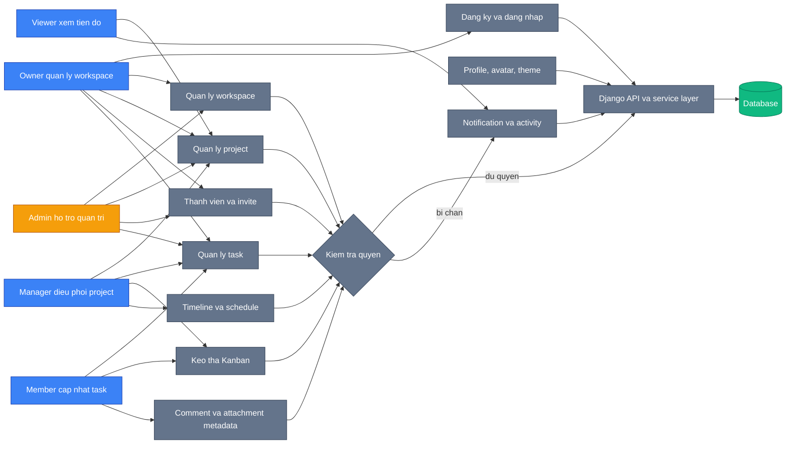

# TaskFlow Use Case Overview

So do nay the hien cac vai tro nghiep vu chinh va nhom chuc nang ma moi vai tro su dung trong TaskFlow. Trong diagram, `Owner`, `Admin`, `Manager`, `Member`, `Viewer` la role nghiep vu trong ung dung; `System` va `DB` dai dien cho backend va database.

