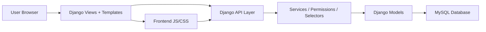

# Project Overview

## Ten Du An

**TaskFlow Project Hub** - he thong quan ly cong viec, workspace, project, task, thanh vien, file va dashboard.

## Muc Tieu

Du an duoc xay dung de ho tro nhom quan ly project theo quy trinh:

```text
Workspace -> Project -> Task -> User / Team
```

Nguoi dung co the:

- Dang ky, dang nhap bang email/password.
- Dang nhap bang Google OAuth khi da cau hinh client ID/secret.
- Tao workspace, project va task.
- Quan ly task bang Kanban View, List View va Calendar View.
- Cap nhat status, priority, deadline va progress cua task.
- Theo doi dashboard thong ke workload, status va progress.
- Quan ly thanh vien, loi moi, files va settings.
- Chuyen doi dark mode/light mode.

## Cong Nghe Su Dung

| Lop | Cong nghe |
| --- | --- |
| Backend | Python, Django |
| Database | MySQL, SQLite fallback |
| Authentication | Django auth, django-allauth Google OAuth |
| Frontend | Django templates, Tailwind CSS, JavaScript |
| Realtime/ASGI | Daphne, ASGI |
| Deployment | Docker, Railway |
| QA | Playwright screenshots, Django tests |

## Pham Vi Chuc Nang

### Da co

- User authentication.
- Workspace/Team model.
- Project model.
- Task model voi status, priority, progress, schedule.
- Kanban drag/drop status.
- Dashboard lay du lieu tu database.
- Files page dua tren project/task attachment.
- Settings page cho profile, preferences, account, team permissions.
- MySQL config qua `.env`.
- Light/dark UI screenshots.

### Chua hoan thien hoan toan

- Friend request/chat flow can duoc test sau hon.
- Google login can cau hinh credential that tren Google Cloud/Railway.
- File upload hien dang luu metadata attachment, chua co storage file that day du.
- Realtime collaboration can bo sung kenh sync ro rang hon.

## Kien Truc Tong Quan



