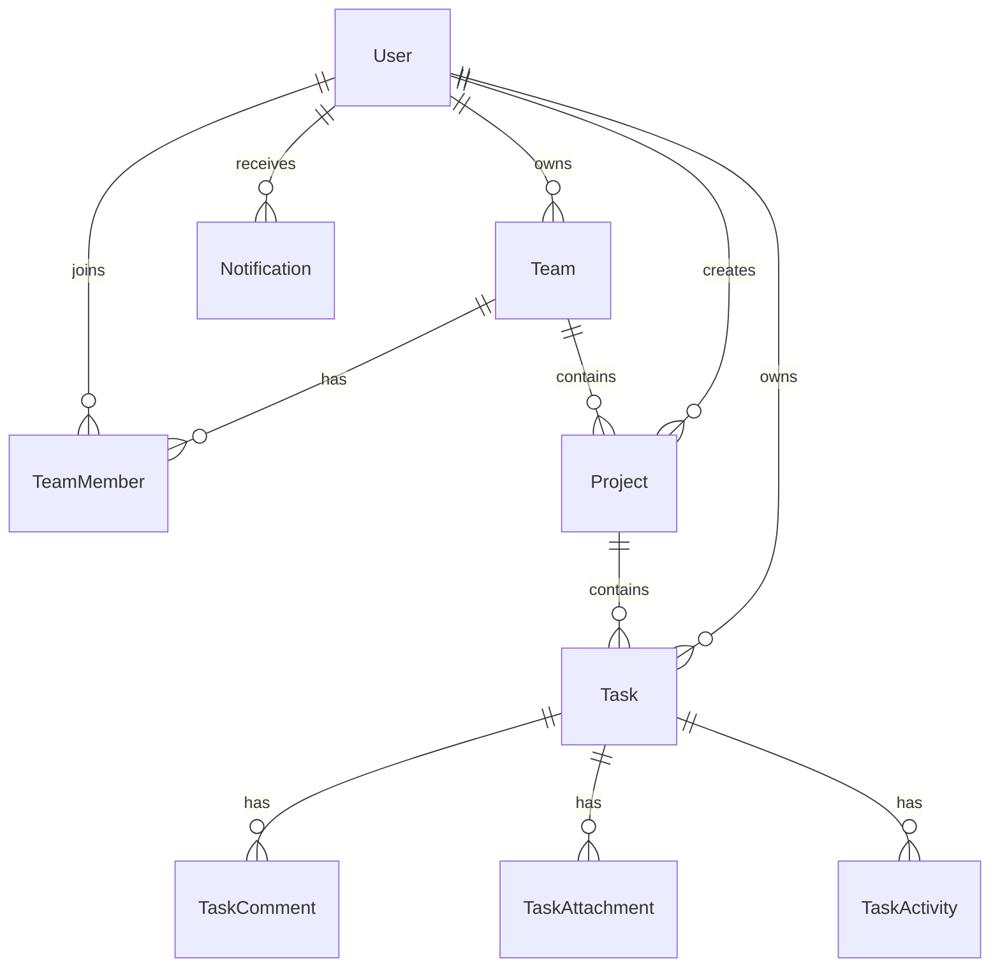

# Django Models Documentation

## Tong Quan Quan He



## Team

File: `backend/apps/tasks/models/team.py`

Dung de dai dien cho Workspace.

| Field | Type | Ghi chu |
| --- | --- | --- |
| `name` | CharField | Ten workspace |
| `description` | TextField | Mo ta |
| `owner` | ForeignKey User | Chu so huu workspace |
| `created_at` | DateTimeField | Ngay tao |
| `updated_at` | DateTimeField | Ngay cap nhat |

## TeamMember

Dung de quan ly thanh vien va role trong workspace.

| Field | Type | Ghi chu |
| --- | --- | --- |
| `team` | ForeignKey Team | Workspace |
| `user` | ForeignKey User | Thanh vien |
| `role` | CharField | `owner`, `admin`, `member`, `viewer` |
| `status` | CharField | `active`, `inactive` |
| `positions` | CharField | Vi tri, vi du Developer/QA |
| `joined_at` | DateTimeField | Ngay tham gia |

Rang buoc:

```text
unique_team_member = team + user
```

## Project

File: `backend/apps/tasks/models/project.py`

| Field | Type | Ghi chu |
| --- | --- | --- |
| `name` | CharField | Ten project |
| `description` | TextField | Mo ta project |
| `user` | ForeignKey User | Nguoi tao |
| `team` | ForeignKey Team | Workspace chua project |
| `created_at` | DateTimeField | Ngay tao |

Rang buoc:

```text
unique_project_name_per_user = user + name
```

## ProjectMember

Quan ly role theo tung project.

| Field | Type | Ghi chu |
| --- | --- | --- |
| `project` | ForeignKey Project | Project |
| `user` | ForeignKey User | Thanh vien |
| `role` | CharField | `manager`, `member`, `viewer` |
| `joined_at` | DateTimeField | Ngay tham gia |

## Task

File: `backend/apps/tasks/models/task.py`

| Field | Type | Ghi chu |
| --- | --- | --- |
| `user` | ForeignKey User | Nguoi tao/owner |
| `project` | ForeignKey Project | Project chua task |
| `title` | CharField | Tieu de task |
| `description` | TextField | Mo ta |
| `due_date` | DateField | Deadline |
| `status` | CharField | `todo`, `in_progress`, `review`, `done` |
| `priority` | CharField | `low`, `medium`, `high` |
| `progress` | PositiveSmallIntegerField | 0-100% |
| `position` | PositiveIntegerField | Thu tu hien thi |
| `start` | FloatField | Gio bat dau tren calendar |
| `duration` | FloatField | Thoi luong |
| `row` | PositiveIntegerField | Dong hien thi calendar |
| `color` | CharField | Lop mau UI |
| `category` | CharField | Loai task |
| `assignees` | ManyToMany User | Nguoi duoc giao |
| `favorited_by` | ManyToMany User | User da favorite |
| `created_at` | DateTimeField | Ngay tao |
| `updated_at` | DateTimeField | Ngay cap nhat |

Quy tac nghiep vu progress:

- Task moi mac dinh `progress = 0`.
- Neu status la `done`, progress duoc set ve `100`.
- Neu status khac `done`, progress do user cap nhat bang slider.

## TaskComment

File: `backend/apps/tasks/models/task_detail.py`

| Field | Type | Ghi chu |
| --- | --- | --- |
| `task` | ForeignKey Task | Task lien quan |
| `user` | ForeignKey User | Nguoi comment |
| `body` | TextField | Noi dung |
| `created_at` | DateTimeField | Ngay tao |

## TaskAttachment

| Field | Type | Ghi chu |
| --- | --- | --- |
| `task` | ForeignKey Task | Task lien quan |
| `user` | ForeignKey User | Nguoi upload |
| `name` | CharField | Ten file |
| `size` | CharField | Dung luong hien thi |
| `created_at` | DateTimeField | Ngay tao |

## Notification

File: `backend/apps/tasks/models/activity.py`

Dung de hien thi thong bao trong dashboard/team/files/settings.

| Field | Type | Ghi chu |
| --- | --- | --- |
| `recipient` | ForeignKey User | Nguoi nhan |
| `actor` | ForeignKey User | Nguoi thuc hien |
| `type` | CharField | `task`, `project`, `team`, `chat` |
| `body` | CharField | Noi dung |
| `target_type` | CharField | Loai doi tuong |
| `target_id` | CharField | ID doi tuong |
| `read_at` | DateTimeField | Da doc luc nao |
| `created_at` | DateTimeField | Ngay tao |

