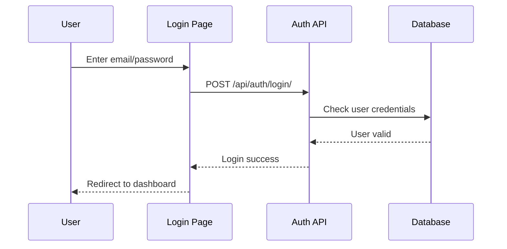
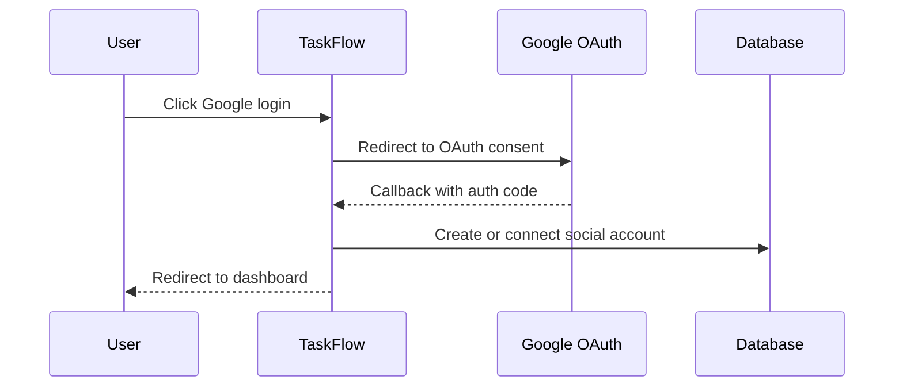

# Authentication And Authorization

## Authentication

He thong ho tro:

- Dang ky bang email/password.
- Dang nhap bang email/password.
- Dang xuat.
- Google OAuth thong qua django-allauth.

## Local Login Flow



## Google Login Flow



## Env Cho Google Login

```env
GOOGLE_CLIENT_ID=your-google-client-id
GOOGLE_CLIENT_SECRET=your-google-client-secret
```

Redirect URI local:

```text
http://127.0.0.1:8000/accounts/google/login/callback/
```

Redirect URI Railway can thay bang domain deploy:

```text
https://your-railway-domain/accounts/google/login/callback/
```

## Authorization Roles

### Workspace Role

| Role | Quyen |
| --- | --- |
| owner | Quan ly toan bo workspace |
| admin | Tao project/task, moi thanh vien, quan ly mot phan |
| member | Tham gia lam viec, cap nhat task duoc giao |
| viewer | Chi xem |

### Project Role

| Role | Quyen |
| --- | --- |
| manager | Quan ly project |
| member | Tham gia project |
| viewer | Chi xem project |

## Permission Rules Trong Code

File: `backend/apps/tasks/permissions.py`

| Function | Y nghia |
| --- | --- |
| `can_view_workspace(user, team)` | Kiem tra user co duoc xem workspace |
| `can_manage_workspace(user, team)` | Kiem tra user co quyen quan ly workspace |
| `can_view_project(user, project)` | Kiem tra user co duoc xem project |
| `can_manage_project(user, project)` | Kiem tra user co quyen quan ly project |
| `can_edit_task(user, task)` | Kiem tra user co duoc sua task |

## Nguyen Tac Bao Mat

- Moi API can user authenticated truoc khi thao tac du lieu rieng.
- User chi thay project/task ma minh tao, workspace minh so huu, hoac workspace minh la member.
- Khong commit `.env`.
- Khi deploy phai cau hinh `SECRET_KEY`, `ALLOWED_HOSTS`, database va Google OAuth credential that.

